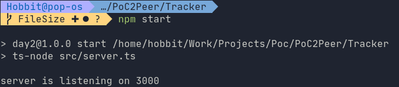
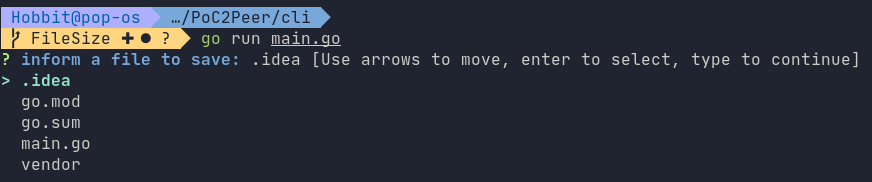
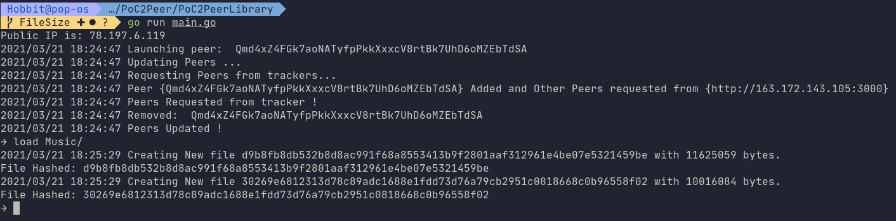

# PoC2Peer

# Table Of Content
- [PoC2Peer](#poc2peer)
- [Table Of Content](#table-of-content)
- [Introduction](#introduction)
- [How to use](#how-to-use)
    * [Tracker](#tracker)
    * [CLI](#cli)
    * [Permanent Peer](#permanent-peer)
    * [Android](#android)
- [Requirements.](#requirements)
    + [Android Application](#android-application)
    + [Tracker](#tracker-1)
    + [P2P Library](#p2p-library)
    + [CLI](#cli-1)
- [Features](#features)
- [Possible Improvements](#possible-improvements)
- [Timeline](#timeline)

<small><i><a href='http://ecotrust-canada.github.io/markdown-toc/'>Table of contents generated with markdown-toc</a></i></small>

# Introduction

PoC2Peer is a streaming application for listening Music using BitTorrent Protocol.

It's composed of 4 parts:

 - It uses a P2P Library written in [Go](https://golang.org/) based on [IPFS libp2p](https://libp2p.io/)

 - A Tracker is used to keep information about available files and Connected Peers.

 - Uamp is the base Application for the player.

:warning: Without other users with the application running, you have to use a permanent peer as explained below.

# How to use

- ## Tracker
  **Directory:** Tracker/

  Go to tracker's directory.
    - run `npm i` to install/update dependencies.
    - launch tracker with either:
      ```shell
      npm init
      npm start
      ```
      or
      ```shell
      make run
      ```
      
    - The tracker can be entirely reset with
      ```shell
      make clean
      ```
- ## CLI
  **Directory:** CLI/

  Go to CLI's directory.
    ```shell
    go mod download
    go run main.go
    ```
  Follow instructions to upload Metadata.
  

- ## Permanent Peer
  **Directory:** PoC2PeerLibrary/

  Go to PoC2PeerLibrary directory.
    ```shell
    go run main.go
    ```
  You are now in a CLI.
  You can load all files from a directory with:
    ```shell
      load [directory]
    ```
  

- ## Android
  **Directory:** app/

  Either:
    - Open Project with Android Studio and run application.
    - Build Apk and install it on your android.
    
  You Should Have a list of files kept by the tracker

# Requirements.

- ### Android Application
    - #### [Android Studio](https://developer.android.com/studio)
    - #### [Kotlin](https://developer.android.com/kotlin)
- ### Tracker
    - #### [Node](https://nodejs.org/en/)
      Coded Typescript and use Express to manage requests made by Kotlin Application, Go Library and CLI.
    - #### [Prisma](https://www.prisma.io/)
      Prisma (ORM) is used with postgres to store available files' metadata and connected peers.
    - #### [Docker](https://www.docker.com/)
      Postgres is containerized with docker.
    - #### (Optional) [GNU Make](https://www.gnu.org/software/make/manual/make.html)
      A Makefile is provided to ease tracker manipulation.
- ### P2P Library
    - #### [Golang](https://golang.org/)
    - #### (Optional)[GoMobile](https://github.com/golang/mobile)

- ### CLI
    - #### [Golang](https://golang.org/)
      Go is the main (and only) language used in CLI.

# Features

- [x] Send files metadata to the tracker.
- [x] Load files into permanent peer
- [x] Request File from a Peer
- [x] Listen Requested Files with UAMP

# Possible Improvements

- [ ] Add a message type to dump file in storage and store this in remote peer
- [ ] Upgrade local storage to write file given a configuration file.
- [ ] Log System in file and level of verbose.

# Timeline
